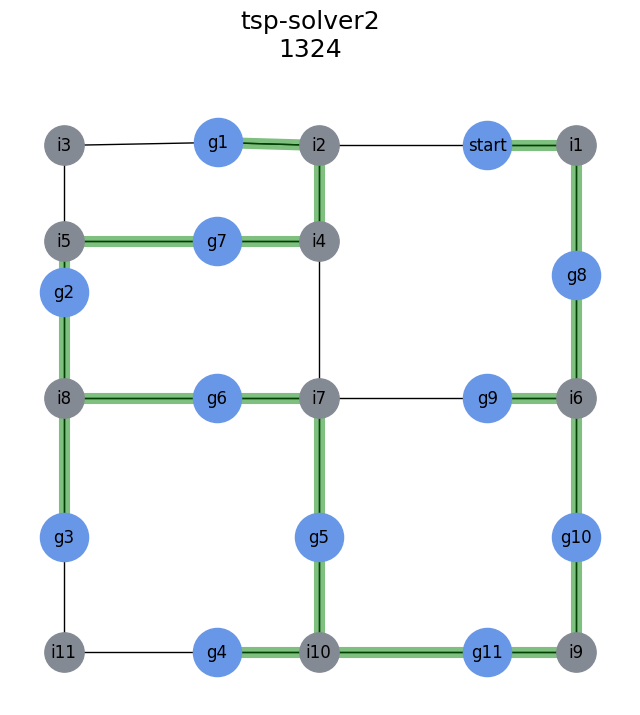
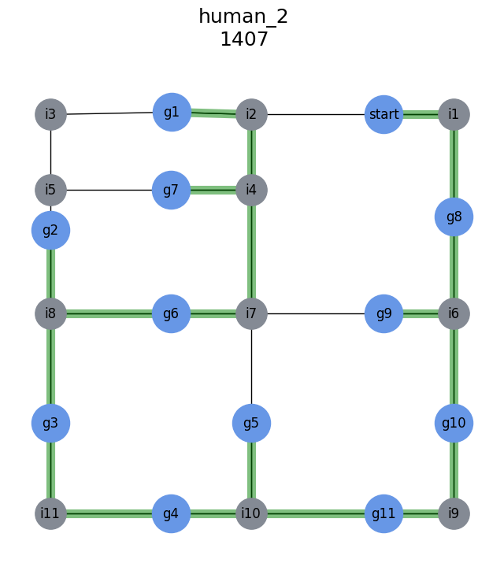

# Shortest path

## Background
This analysis was conducted with the student organization [DNV GL Fuel Fighter](https://www.fuelfighter.no/) as part of solving a challenge in the [Shell Eco Marathon Virtual Programming League](https://www.makethefuture.shell/en-gb/shell-eco-marathon). Given a virtual environment and a set of waypoints, our task was to program a car that navigated autonomously in the environment and visited all the required waypoints. Teams were ranked according to driving time and fuel consumption in the virtual environment, as well as the CPU load for the submitted program.

We wanted to find the sequence of waypoints that visited all the goal nodes with the minimum total driving distance. We also wanted a visualization of the paths in order to assess whether a longer route could have a more promising fuel consumption profile.

## Technical overview
- Goal waypoints and intersections are represented as nodes in a network graph using [NetworkX](https://networkx.org/).
- Edges are weighted according to the distance between them.
- The distance between any two nodes are found with [Dijkstra's algorithm](https://en.wikipedia.org/wiki/Dijkstra%27s_algorithm) and [Floyd-Warshall algorithm](https://en.wikipedia.org/wiki/Floyd%E2%80%93Warshall_algorithm).
- The shortest path is found using different techniques for solving the [Travelling salesman problem](https://en.wikipedia.org/wiki/Travelling_salesman_problem).
- The network graph is visualized using [matplotlib](https://matplotlib.org/) with highlighted paths.

## Summary
The team ran a mini-competition for who could find the shortest route from just looking at the provided map image. None of us came up with the optimal solution, which required the car to reverse to the first waypoint. Amusingly, the competition data revealed that the car in the simulated environment performed identically whether it was driving forwards or backwards. Our program therefore ended up reversing through most of the route.

The overall challenge suffered from a couple of technical problems from Shell's side. The best performant programs had hard-coded instructions instead of navigating autonomously. The metric for the CPU load was also affected by external programs on the server and it was possible to take shortcuts by driving in between houses. It was nevertheless a fun and interesting challenge to tackle.

### Map
<table align="center">
  <tr>
    <td>
      

         
        <b>Provided map</b>
      
 
    </td>
  </tr>
  <tr>
    <td>
      

         
        <b>Graph representation</b>
      

    </td>
  </tr>
</table>

### Solutions

<table>
  <tr>
    <td></td>
    <td></td>
    </tr><tr>
    <td></td>
    <td></td>
  </tr>
</table>

#### Best solution

Nodes are visited in the following order:

`['start', 'i1', 'g8', 'i6', 'g9', 'i6', 'g10', 'i9', 'g11', 'i10', 'g4', 'i10', 'g5', 'i7', 'g6', 'i8', 'g3', 'i8', 'g2', 'i5', 'g7', 'i4', 'i2', 'g1']`

Minimal list of waypoints (x, y) in the local coordinate system:

`[(0, 0), (44.5, 0.0), (44.5, -128), (0.0, -128.0), (44.5, -128), (44.5, -256), (-135.5, -256.0), (-84.5, -256.0), (-84.5, -128.0), (-212.0, -128.0), (-212.0, -198.22), (-212.0, -48.2), (-84.5, -48.2), (-84.5, 0.0), (-135, 1.5)]`

I later confirmed via a brute force-approach that this indeed is the shortest route.

## Full analysis
Open the [Jupiter Notebook](./nx_graph.ipynb) for the full analysis.